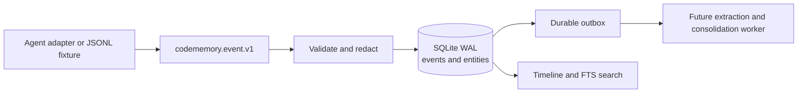

# CodeSementicMemory

CodeSementicMemory is a local, SQLite-first long-term memory core specialized for coding agents and vibe-coding workflows. The repository name keeps the original `codeSementicMemory` spelling; the Python package and CLI are named `codememory`.

The first-round product is intentionally below the LLM layer. It captures trustworthy coding evidence through a stable event contract, persists it idempotently, and creates durable outbox work for the extraction/consolidation layer that will follow.

## First-round status

Implemented:

- Versioned `codememory.event.v1` event envelope for messages, tools, files, commands, validation, VCS changes, feedback, and session boundaries.
- SQLite canonical store with repeatable migration, foreign-key checks, WAL mode, integrity health, coding entities, events, FTS5 projection, and durable outbox.
- Idempotency by event id, producer/external id, and session sequence; reused identities with different content return a conflict.
- Ingress secret redaction before persistence.
- Content-addressed artifact metadata with bounded excerpts and `truncated` markers.
- Shared ingest service used by localhost HTTP and JSONL replay.
- Timeline, FTS search, health/doctor, backup, and outbox inspection/lease operations.
- Seven deterministic coding-session fixtures (including six minimal edge-case streams) and automated unit/integration tests.

Not in this round:

- LLM memory-card extraction and consolidation.
- Card/entity/relation lifecycle and code-snapshot validation.
- Embedding/vector projection.
- Codex Desktop or other agent adapters.
- Web/3D graph visualization.

These remain separate layers; they do not require replacing the event store.

## Runtime shape



HTTP, CLI replay, and future adapters all enter through the same `IngestService`. Ingestion never waits for an LLM, embedding model, or downstream worker.

## Quick start

Python 3.12 or newer is required.

```powershell
py -m venv .venv
.venv\Scripts\python -m pip install -e ".[dev]"

$db = Join-Path $env:TEMP "codememory-demo.sqlite3"
.venv\Scripts\codememory init --db $db
.venv\Scripts\codememory replay fixtures/route-success.jsonl --db $db
.venv\Scripts\codememory health --db $db
.venv\Scripts\codememory doctor --db $db
.venv\Scripts\codememory timeline task-npc-share --db $db
.venv\Scripts\codememory search "ShareManager" --db $db
.venv\Scripts\codememory rebuild-search --db $db
.venv\Scripts\codememory schema validate fixtures/route-success.jsonl
.venv\Scripts\codememory export backup.jsonl --db $db --task-id task-npc-share
```

Run the localhost API:

```powershell
.venv\Scripts\codememory serve --db $db --host 127.0.0.1 --port 8765
```

Interactive API documentation is then available at `http://127.0.0.1:8765/docs`.

If `--db` is omitted, the path is resolved from `CODEMEMORY_DB`, then `CODEMEMORY_DATA_DIR`, then the platform-local application data directory.

## HTTP surface

| Method | Route | Purpose |
| --- | --- | --- |
| `GET` | `/v1/health` | Schema, WAL, integrity, entity counts, and outbox counts |
| `POST` | `/v1/events` | Validate, redact, and atomically ingest one event |
| `POST` | `/v1/events/batch` | Ingest up to 500 events with per-event results |
| `POST` | `/v1/replay` | Replay an in-memory event batch through the same service |
| `GET` | `/v1/tasks/{task_id}/timeline` | Inspect the ordered evidence timeline |
| `GET` | `/v1/search?q=...` | Query the rebuildable FTS5 projection |
| `GET` | `/v1/outbox` | Inspect durable downstream jobs |
| `POST` | `/v1/outbox/claim` | Lease jobs for a future extractor worker |
| `POST` | `/v1/outbox/{job_id}/complete` | Acknowledge a leased job |
| `POST` | `/v1/outbox/{job_id}/fail` | Retry or dead-letter a leased job |

An accepted event returns HTTP `201`; an exact duplicate returns `200` and the original outbox id; a reused identity with changed content returns `409`.

## Event contract

The human-readable JSON Schema is at [`schemas/codememory.event.v1.json`](schemas/codememory.event.v1.json). Protocol notes are in [`src/codememory/docs/event-protocol.md`](src/codememory/docs/event-protocol.md); the executable Pydantic contract is `codememory.domain.events.EventEnvelope`. The future extraction boundary is described in [`src/codememory/docs/extraction-contract.md`](src/codememory/docs/extraction-contract.md).

The envelope keeps stable routing fields at the top level and adapter-specific information inside `context` or `payload`:

```json
{
  "schema_version": "codememory.event.v1",
  "event_id": "evt-001",
  "external_event_id": "agent-native-id",
  "event_type": "file_edit",
  "occurred_at": "2026-09-02T08:01:00Z",
  "producer": {
    "agent_id": "codex-local",
    "adapter": "codex-hook",
    "adapter_version": "0.1"
  },
  "project_id": "project-id",
  "task_id": "task-id",
  "session_id": "session-id",
  "seq": 6,
  "parent_event_id": "evt-000",
  "context": {
    "repo_id": "repo-id",
    "root_path": "D:/workspace/project",
    "branch": "feature/example",
    "commit_id": "abc123"
  },
  "payload": {
    "path": "src/example.py",
    "symbols": ["Example.run"]
  },
  "artifacts": [],
  "redaction": {
    "applied": false,
    "ruleset_version": "builtin-v1",
    "fields": []
  },
  "source": "agent",
  "completeness": "full"
}
```

Parent links are allowed to arrive out of order. They are indexed but intentionally not a SQLite foreign key, so a partial or late adapter stream does not lose evidence.

## SQLite guarantees

- Migration files are ordered and recorded in `schema_migrations`.
- One transaction persists the event, updates its project/task/session entities, writes the FTS projection, and creates its deduplicated `event.ingested` outbox job.
- `codememory export` emits canonical JSON/JSONL envelopes for migration and an additional human-readable backup path.
- Downstream jobs support claim leases, expired-lease recovery, exponential retry, completion, and dead-letter status.
- Raw coding events are append-only through the public repository API. Search is a projection and can be rebuilt later.
- The current built-in redactor removes common API key, token, authorization, password, and `sk-...` patterns from payloads and artifact metadata before storage.

## Development and verification

```powershell
py -m pytest -q
```

The fixture `fixtures/route-success.jsonl` models a successful request-to-code route: user intent, searches, source reads, edits, validation, VCS revision, final answer, and session completion. Replaying it twice must produce 12 accepted events followed by 12 duplicates without adding rows or outbox jobs. The other streams in [`fixtures/index.json`](fixtures/index.json) cover partial input, failed validation, refactoring, feedback correction, and the smallest complete session; each has a checked-in expected result under `fixtures/expected/`.

## Next implementation slice

The next phase consumes `event.ingested` outbox jobs and adds the coding-specific memory pipeline:

1. Task-window assembly from immutable events.
2. Strict LLM candidate JSON for route observations, decisions, failures, conventions, and validation outcomes.
3. Deterministic merge/link/version policy with provenance and confidence.
4. Code-entity resolution against the current repository snapshot.
5. Hybrid retrieval over structured filters, FTS, optional embeddings, and graph expansion.

The LLM and embedding providers will remain replaceable plugins; neither becomes the canonical store.
