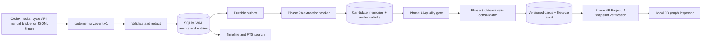

# CodeSementicMemory

CodeSementicMemory is a local, SQLite-first long-term memory core specialized for coding agents and vibe-coding workflows. The repository name keeps the original `codeSementicMemory` spelling; the Python package and CLI are named `codememory`.

The canonical store remains below the LLM layer, while the repository now also
contains an offline-first Phase 2A/3 extraction and consolidation slice plus
Phase 4A quality gating, Phase 4B Project_J code-binding verification, a
manual-first Phase 5A agent bridge, and an incremental Phase 6 agent-memory
cycle. It
captures trustworthy coding evidence through a stable event contract, persists
it idempotently, extracts auditable candidate memories, validates their
evidence deterministically, and exposes their evidence graph locally.

## Current status (Phase 0–1 + Phase 2A + Phase 3 + Phase 4A + Phase 4B + Phase 5A + Phase 6)

Implemented:

- Versioned `codememory.event.v1` event envelope for messages, tools, files, commands, validation, VCS changes, feedback, and session boundaries.
- SQLite canonical store with repeatable migration, foreign-key checks, WAL mode, integrity health, coding entities, events, FTS5 projection, and durable outbox.
- Idempotency by event id, producer/external id, and session sequence; reused identities with different content return a conflict.
- Ingress secret redaction before persistence.
- Content-addressed artifact metadata with bounded excerpts and `truncated` markers.
- Shared ingest service used by localhost HTTP and JSONL replay.
- Timeline, FTS search, health/doctor, backup, and outbox inspection/lease operations.
- Seven deterministic coding-session fixtures (including six minimal edge-case streams) and automated unit/integration tests.
- Strict `codememory.extraction_batch.v1` models and evidence-closed candidate validation.
- Deterministic `MockLLMProvider`, idempotent `extraction_runs`, candidate memory rows, and rebuildable candidate FTS.
- A bounded Codex history importer; the three authorized seed threads are captured in [`fixtures/codex-history/selected-threads.json`](fixtures/codex-history/selected-threads.json) with `partial` provenance.
- An outbox extraction worker and CLI commands for importing history, extracting a task, listing memories, and printing the graph projection.
- A local Three.js 3D graph inspector served by the same localhost API.
- Versioned memory cards with deterministic merge/new-version decisions, evidence and binding links, lifecycle audit, and rebuildable card FTS.
- A coding-focused offline extractor that suppresses empty/admin noise and distinguishes modified-file evidence from context hints.
- Bounded replay of the complete locally indexed visible Codex history export, with source-time ordering, host-block filtering, and partial provenance.
- A deterministic, versioned quality gate for events and extracted candidates, with accepted/review/quarantine decisions and auditable reasons.
- Logical project scopes and explicit aliases, including a reviewed Project_J mapping across raw Codex project ids.
- Idempotent dry-run/write quality replay with bounded transactions, input hashes, and stale-run recovery after interrupted processes.
- Route-first retrieval: non-quarantined proposed/review cards remain available as low-confidence coding entry hints, while verified/stable cards rank first; quarantine remains hidden by default.
- Quality reports and API/CLI surfaces for project scope, candidate review, replay, and operational diagnosis.
- Versioned Phase 4B snapshot manifests and append-only binding verification runs.
- Exact normalized manifests are retained in SQLite (`code_snapshots.manifest_json`) for
  replay/audit; capture timestamps do not perturb content-addressed identities.
- Project_J-only P4 `fstat` and CodeBaseMemory graph/index manifest adapters with safe
  `verified`, `missing`, `renamed`, `stale`, `unverified`, and `rejected` states.
- Dry-run/write verification CLI and REST endpoints; provider failures never demote an
  existing authoritative binding, and bounded snapshots cannot imply repository-wide absence.
- 3D graph/file/symbol nodes display the current binding verification state.
- Manual-first `start/query/capture/finish` AgentBridgeService for Codex and future
  coding agents; it uses the existing event, extraction, consolidation, and query
  services without a private desktop hook.
- Localhost `/v1/agent/{start,query,capture,finish}` routes and
  `codememory agent {start,query,capture,finish}` commands with stable identities,
  summary completeness, duplicate replay, and changed-content conflicts.
- Incremental `AgentMemoryCycleService` with durable cycle cursors, prompt/tool
  observations, stop-time extraction, close-time lifecycle updates, and idempotent
  card-use/outcome feedback.
- Localhost `/v1/agent/cycle/{open,prompt,checkpoint,close}` routes and matching
  CLI payload commands for adapters that do not have native hooks.
- Codex lifecycle hook adapter in [`integrations/codex/codememory_hook.py`](integrations/codex/codememory_hook.py):
  route hints on prompt submit, bounded visible file evidence after tools, and
  one bounded current-LLM maintenance continuation at stop, followed by validated
  extraction/consolidation. It fails open and never reads hidden reasoning or
  private Codex databases.
- A Codex manual Skill guide and sanitized Project_J evidence fixtures at
  [`src/codememory/docs/codex-manual-agent-skill.md`](src/codememory/docs/codex-manual-agent-skill.md)
  and [`fixtures/agent-bridge/`](fixtures/agent-bridge/).

The local replay database is an external runtime artifact, not a checked-in
fixture. The 2026-09-04 delivery replayed 2,573 indexed visible threads into
54,684 canonical events; the first extraction pass covered 1,082 tasks and a
follow-up replay covered one additional task, for 1,083 successful runs in
total. The database contains 2,304 candidates / 1,798 proposed cards.
Remaining imported tasks can be resumed with `extract-all` in bounded batches.

The Phase 4A quality replay is a real local baseline, not a synthetic fixture.
On 2026-09-04 it evaluated 54,684 canonical events and 2,304 candidates while
preserving the raw event and card evidence. The v2 gate marked 8 cross-project
event references and 5 candidate references as `scope_mismatch` for review;
16 effective raw project ids currently map to 14 logical scopes.
The Project_J logical-scope replay then covered 54,089 events and 2,292
candidates with zero in-scope mismatches; its replay hash is recorded in the
Phase 4A delivery note for deterministic follow-up checks.
The detailed rules, reports, and verification boundary are recorded in
[`src/codememory/docs/phase4a-quality-gate.md`](src/codememory/docs/phase4a-quality-gate.md).

Phase 4B real validation uses a small, sanitized Project_J baseline at
[`fixtures/verification/project-j-baseline.json`](fixtures/verification/project-j-baseline.json).
It contains only paths, symbols, revisions, and provider metadata—not source code,
credentials, or the local runtime database. Against the three authorized seed tasks,
the baseline produced 38 checked bindings: 4 `verified`, 33 `unverified` (the
manifest is intentionally bounded to selected paths), and 1 `rejected`. A
follow-up Project_J-wide projection check covered 6,412 current bindings; it
kept 6 verified / 4 renamed states, left 6,376 outside the bounded evidence as
`unverified`, and rejected 26 non-concrete targets without treating omissions as
repository-wide `missing`.

Not in this round:

- Full-repository (`coverage=complete`) snapshot generation and automatic snapshot refresh.
- AST/LSP method-level validation beyond the manifest bridge.
- Embedding/vector projection.
- Full transcript replay from opaque/private Codex app storage; visible hook fields
  and the sanitized history importer are the supported compatibility boundary.
- Production web hosting, authentication, and a production-grade graph layout.

These remain separate layers; they do not require replacing the event store.

## Runtime shape



HTTP, CLI replay, and future adapters all enter through the same `IngestService`. Ingestion never waits for an LLM, embedding model, or downstream worker.

## Quick start

Python 3.12 or newer is required.

```powershell
py -m venv .venv
.venv\Scripts\python -m pip install -e ".[dev]"

$db = Join-Path $env:TEMP "codememory-demo.sqlite3"
.venv\Scripts\codememory init --db $db
.venv\Scripts\codememory replay fixtures/route-success.jsonl --db $db
.venv\Scripts\codememory health --db $db
.venv\Scripts\codememory doctor --db $db
.venv\Scripts\codememory timeline task-npc-share --db $db
.venv\Scripts\codememory search "ShareManager" --db $db
.venv\Scripts\codememory rebuild-search --db $db
.venv\Scripts\codememory schema validate fixtures/route-success.jsonl
.venv\Scripts\codememory export backup.jsonl --db $db --task-id task-npc-share
```

Run the offline Phase 2A sample with the selected local Codex history:

```powershell
$history = "fixtures/codex-history/selected-threads.json"
.venv\Scripts\codememory import-codex-history $history --db $db
.venv\Scripts\codememory extract codex-thread:01a00f1c-1f03-7b01-9b94-e661258dde04 --db $db
.venv\Scripts\codememory memories --db $db --task-id codex-thread:01a00f1c-1f03-7b01-9b94-e661258dde04
.venv\Scripts\codememory graph --db $db --task-id codex-thread:01a00f1c-1f03-7b01-9b94-e661258dde04
.venv\Scripts\codememory consolidate --db $db --task-id codex-thread:01a00f1c-1f03-7b01-9b94-e661258dde04
.venv\Scripts\codememory cards --db $db --task-id codex-thread:01a00f1c-1f03-7b01-9b94-e661258dde04
```

For a larger local history replay, keep the raw export outside Git and use the
bounded run described in [`src/codememory/docs/phase3-delivery.md`](src/codememory/docs/phase3-delivery.md).

Run the localhost API:

```powershell
.venv\Scripts\codememory serve --db $db --host 127.0.0.1 --port 8765
```

Open `http://127.0.0.1:8765/` for the local 3D graph inspector. Interactive API documentation is available at `http://127.0.0.1:8765/docs`.

If `--db` is omitted, the path is resolved from `CODEMEMORY_DB`, then `CODEMEMORY_DATA_DIR`, then the platform-local application data directory.

Manual-first Agent smoke flow:

```powershell
.venv\Scripts\codememory agent start --db $db `
  --project-id project_j --task-id task-demo --session-id session-demo `
  --intent "NPC 交互结束后打开通用分享界面"
.venv\Scripts\codememory agent query "ShareManager" --project-id project_j --db $db --retrieval-mode route
.venv\Scripts\codememory agent capture fixtures/agent-bridge/project-j-capture.json --db $db
.venv\Scripts\codememory agent finish fixtures/agent-bridge/project-j-finish.json --db $db
```

The same lifecycle is available over `/v1/agent/start`, `/v1/agent/query`,
`/v1/agent/capture`, and `/v1/agent/finish`. See the Codex-specific manual
instructions in [`src/codememory/docs/codex-manual-agent-skill.md`](src/codememory/docs/codex-manual-agent-skill.md).

Automatic Codex integration is installed from the repository's
[`integrations/codex/hooks.json`](integrations/codex/hooks.json) template. The
current user profile also has the equivalent global hook configuration. Codex
may require a one-time review/approval in the app's Hooks settings. The hook
uses the platform-local database unless `CODEMEMORY_DB` is set, and maps
`Project_J` to `project_j` (override with `CODEMEMORY_PROJECT_ID`).

For Codex-driven historical extraction and memory maintenance, use the installed
`$codememory-memory` Skill instead of manually typing the lifecycle commands. Its
versioned source is [`skills/codememory-memory/SKILL.md`](skills/codememory-memory/SKILL.md);
route-first retrieval semantics are documented in
[`src/codememory/docs/phase6-route-first-retrieval.md`](src/codememory/docs/phase6-route-first-retrieval.md).
it resolves visible history, runs bounded import/extract/consolidate operations, and
reports duplicates, conflicts, quality decisions, card changes, and query evidence.
The automatic lifecycle and retry semantics are documented in
[`src/codememory/docs/phase6-agent-cycle.md`](src/codememory/docs/phase6-agent-cycle.md).

Verify the Project_J seed bindings against a provider snapshot (dry-run first):

```powershell
.venv\Scripts\codememory verify-bindings --db $db `
  --logical-project-id logical-319e6e98c97340e7807d6bb7 `
  --manifest fixtures/verification/project-j-baseline.json `
  --task-id codex-thread:01a04cae-4577-7f22-b29f-80ffb07afcbc
.venv\Scripts\codememory verification-report --db $db
```

需要审计快照原文时可加 `--include-manifest`（建议把 `--limit` 保持较小）；默认报告
只返回快照摘要，完整规范化内容可通过 `/v1/verification/snapshots/{snapshot_id}`
读取。

Add `--write` only after reviewing the report. A manifest with
`metadata.coverage=selected_paths` can verify included files, but cannot assert
that every omitted file is missing.

## HTTP surface

| Method | Route | Purpose |
| --- | --- | --- |
| `GET` | `/v1/health` | Schema, WAL, integrity, entity counts, and outbox counts |
| `POST` | `/v1/events` | Validate, redact, and atomically ingest one event |
| `POST` | `/v1/events/batch` | Ingest up to 500 events with per-event results |
| `POST` | `/v1/replay` | Replay an in-memory event batch through the same service |
| `POST` | `/v1/agent/start` | Start an idempotent manual coding-agent session |
| `POST` | `/v1/agent/query` | Query cards and canonical event evidence before coding |
| `POST` | `/v1/agent/capture` | Capture one bounded, summary-completeness coding evidence package |
| `POST` | `/v1/agent/finish` | End a session and optionally extract/consolidate its memory |
| `POST` | `/v1/agent/cycle/open` | Open/resume an incremental agent-memory cycle |
| `POST` | `/v1/agent/cycle/prompt` | Record a visible prompt and return route hints |
| `POST` | `/v1/agent/cycle/checkpoint` | Record stop/tool evidence and optionally extract/consolidate |
| `POST` | `/v1/agent/cycle/close` | Close a cycle and persist final outcome |
| `POST` | `/v1/agent/cycle/prepare` | Return a bounded evidence packet for current-agent LLM extraction |
| `POST` | `/v1/agent/cycle/learn` | Validate and persist current-agent structured memory notes |
| `GET` | `/v1/tasks/{task_id}/timeline` | Inspect the ordered evidence timeline |
| `GET` | `/v1/search?q=...` | Query the rebuildable FTS5 projection |
| `GET` | `/v1/outbox` | Inspect durable downstream jobs |
| `POST` | `/v1/outbox/claim` | Lease jobs for the extraction worker |
| `POST` | `/v1/outbox/{job_id}/complete` | Acknowledge a leased job |
| `POST` | `/v1/outbox/{job_id}/fail` | Retry or dead-letter a leased job |
| `GET` | `/v1/tasks` | List tasks for the graph inspector |
| `GET` | `/v1/tasks/{task_id}/memories` | List candidate memories and bindings (quarantine hidden by default; `include_quarantine` is an audit opt-in) |
| `GET` | `/v1/tasks/{task_id}/extraction-runs` | Inspect extraction attempts and hashes |
| `GET` | `/v1/memories/{candidate_id}` | Inspect one candidate and bounded source excerpts |
| `POST` | `/v1/tasks/{task_id}/extract` | Run the offline mock extractor (explicit worker call) |
| `GET` | `/v1/memories/search?q=...` | Search candidate-memory FTS (quarantine hidden by default; `include_quarantine` is an audit opt-in) |
| `POST` | `/v1/tasks/{task_id}/consolidate` | Merge task candidates into versioned cards |
| `GET` | `/v1/tasks/{task_id}/quality` | Inspect task-level event/candidate quality coverage |
| `GET` | `/v1/quality/report` | Inspect global or logical-project quality statistics and replay audit |
| `POST` | `/v1/quality/replay` | Dry-run or write the deterministic quality projection |
| `POST` | `/v1/verification/bindings` (or `/v1/quality/verify-bindings`) | Verify current Project_J bindings against supplied snapshots |
| `GET` | `/v1/verification/report` | Show binding statuses, snapshot coverage, and verification runs |
| `GET` | `/v1/verification/report?include_manifest=true` | Include normalized manifests for bounded audit responses |
| `GET` | `/v1/verification/snapshots/{snapshot_id}` | Read one complete persisted provider/composite manifest |
| `GET` | `/v1/verification/bindings` | List current Project_J bindings and their latest status |
| `GET` | `/v1/quality/projects` | List logical projects and effective raw-project aliases |
| `POST` | `/v1/quality/projects/aliases` | Register a reviewed raw-project alias |
| `GET` | `/v1/quality/candidates/{candidate_id}` | Inspect candidate quality reasons, dimensions, and evidence |
| `GET` | `/v1/cards` | List versioned cards with status/task/kind and `retrieval_mode=route|trusted|audit` filters |
| `GET` | `/v1/cards/search?q=...` | Search card statements, aliases, and bindings; `route` is recall-first, `trusted` is precision-first |
| `GET` | `/v1/cards/{card_id}` | Inspect versions, evidence, links, decisions, and lifecycle |
| `POST` | `/v1/cards/{card_id}/transition` | Apply an audited lifecycle transition |
| `GET` | `/v1/graph` | Return bounded nodes/edges for the 3D UI (`include_quarantine` is an explicit debug opt-in) |

An accepted event returns HTTP `201`; an exact duplicate returns `200` and the original outbox id; a reused identity with changed content returns `409`.

## Event contract

The human-readable JSON Schema is at [`schemas/codememory.event.v1.json`](schemas/codememory.event.v1.json). Protocol notes are in [`src/codememory/docs/event-protocol.md`](src/codememory/docs/event-protocol.md); the executable Pydantic contract is `codememory.domain.events.EventEnvelope`. The Phase 2A extraction boundary is described in [`src/codememory/docs/extraction-contract.md`](src/codememory/docs/extraction-contract.md).

The envelope keeps stable routing fields at the top level and adapter-specific information inside `context` or `payload`:

```json
{
  "schema_version": "codememory.event.v1",
  "event_id": "evt-001",
  "external_event_id": "agent-native-id",
  "event_type": "file_edit",
  "occurred_at": "2026-09-02T08:01:00Z",
  "producer": {
    "agent_id": "codex-local",
    "adapter": "codex-hook",
    "adapter_version": "0.1"
  },
  "project_id": "project-id",
  "task_id": "task-id",
  "session_id": "session-id",
  "seq": 6,
  "parent_event_id": "evt-000",
  "context": {
    "repo_id": "repo-id",
    "root_path": "D:/workspace/project",
    "branch": "feature/example",
    "commit_id": "abc123"
  },
  "payload": {
    "path": "src/example.py",
    "symbols": ["Example.run"]
  },
  "artifacts": [],
  "redaction": {
    "applied": false,
    "ruleset_version": "builtin-v1",
    "fields": []
  },
  "source": "agent",
  "completeness": "full"
}
```

Parent links are allowed to arrive out of order. They are indexed but intentionally not a SQLite foreign key, so a partial or late adapter stream does not lose evidence.

## SQLite guarantees

- Migration files are ordered and recorded in `schema_migrations`.
- One transaction persists the event, updates its project/task/session entities, writes the FTS projection, and creates its deduplicated `event.ingested` outbox job.
- `codememory export` emits canonical JSON/JSONL envelopes for migration and an additional human-readable backup path.
- Downstream jobs support claim leases, expired-lease recovery, exponential retry, completion, and dead-letter status.
- Raw coding events are append-only through the public repository API. Search is a projection and can be rebuilt later.
- `rebuild-memory --yes` clears only extraction, card, logical-scope, and quality projections; canonical projects/tasks/sessions/events/artifacts and the outbox remain intact.
- The current built-in redactor removes common API key, token, authorization, password, and `sk-...` patterns from payloads and artifact metadata before storage. The implementation record for this round is in [`src/codememory/docs/phase2a-delivery.md`](src/codememory/docs/phase2a-delivery.md).

## Development and verification

```powershell
py -m pytest -q
```

The fixture `fixtures/route-success.jsonl` models a successful request-to-code route: user intent, searches, source reads, edits, validation, VCS revision, final answer, and session completion. Replaying it twice must produce 12 accepted events followed by 12 duplicates without adding rows or outbox jobs. The other streams in [`fixtures/index.json`](fixtures/index.json) cover partial input, failed validation, refactoring, feedback correction, and the smallest complete session; each has a checked-in expected result under `fixtures/expected/`.

## Phase 2A/3/4A/4B boundary and next slices

Phase 2A consumes a task window (directly or through `event.ingested` jobs) and adds the coding-specific candidate pipeline:

1. Task-window assembly from immutable events.
2. Strict LLM candidate JSON for route observations, decisions, failures, conventions, and validation outcomes.
3. Deterministic candidate persistence/linking with provenance and confidence.
4. A bounded local Codex history seed and graph inspection surface.
5. Versioned card consolidation, evidence/binding relations, and guarded lifecycle transitions.
6. Continuous event/candidate quality evaluation, logical project aliases, replay audit, and quarantine-aware retrieval.

Phase 4B now resolves current paths and symbols against explicit P4 and
CodeBaseMemory manifests for Project_J and marks bindings verified, missing,
renamed, stale, unverified, or rejected. Phase 5A adds a manual-first bridge so
an actual Codex task can participate without a private desktop hook. Full-
repository snapshots, AST/LSP method-level checks, periodic refresh, embeddings/
vector projections, MCP packaging, and automatic Codex capture remain separate
replaceable layers; none is required by the SQLite core or by the quality gate.

The complete implementation records are in
[`src/codememory/docs/phase3-delivery.md`](src/codememory/docs/phase3-delivery.md),
[`src/codememory/docs/phase4a-quality-gate.md`](src/codememory/docs/phase4a-quality-gate.md),
and [`src/codememory/docs/phase4b-project-j-verification.md`](src/codememory/docs/phase4b-project-j-verification.md).
The Phase 5A delivery plan and manual Skill contract are recorded in
[`src/codememory/docs/phase5-agent-integration-plan.md`](src/codememory/docs/phase5-agent-integration-plan.md)
and [`src/codememory/docs/codex-manual-agent-skill.md`](src/codememory/docs/codex-manual-agent-skill.md).
